# 🔄 EV Concierge Workflow

## Complete Agent Workflow Diagram

## Agent Communication Flow

## Decision Tree: Charging Strategy

```mermaid
graph TD
    A[User Request] --> B{Parse Trip Details}
    B --> C[Calculate Energy Needs]
    C --> D{Charging Needed?}
    
    D -->|No| E[✅ Sufficient Range]
    E --> F[Send Confirmation]
    
    D -->|Yes| G{Current Battery Level}
    G -->|< 30%| H[Strategy: Pre-Trip Charging]
    G -->|≥ 30%| I[Strategy: En-Route Charging]
    
    H --> J[Search Nearby Chargers]
    I --> K[Search Route Chargers]
    
    J --> L[Compare Options]
    K --> L
    
    L --> M{User Preference?}
    M -->|Speed| N[Select Fastest Charger]
    M -->|Cost| O[Select Cheapest Charger]
    M -->|Convenience| P[Select Closest Charger]
    
    N --> Q[Reserve Slot]
    O --> Q
    P --> Q
    
    Q --> R{Auto-Order Food?}
    R -->|Yes| S[Check Amenities]
    R -->|No| T[Skip Food Order]
    
    S --> U[Place Order]
    U --> V[Process Payment]
    T --> V
    
    V --> W[Generate Summary]
    W --> X[Send to User]
```

## State Machine: Reservation Lifecycle

## Data Flow: Trip to Confirmation

## Tool Execution Flow

## Error Handling Flow

## Real-Time Monitoring Loop

## Multi-Agent Parallel Execution

## Summary

This workflow demonstrates:
- **Sequential coordination** for dependent tasks
- **Parallel execution** where possible (amenities + payment)
- **Error handling** with automatic recovery
- **Real-time monitoring** for proactive issue resolution
- **Clear communication** between all agents

The entire workflow typically completes in **under 30 seconds** from user request to confirmation.
